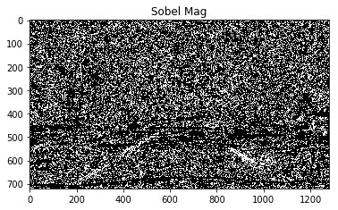
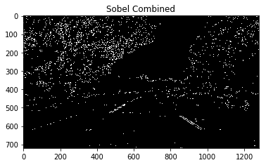

## Advance Lane Detecting

#### Udacity project

#### Briefly state how you computed the camera matrix and distortion coefficients. Provide an example of a distortion corrected calibration image.

The code for caliberation of camera can be found at the function caliberate_camera() which is in the second block of the advance line finding.ipynb. I calculated the camera matrix and the distortion coeffecient using the chessboard images provided by the udacity.

#### Describe how (and identify where in your code) you used color transforms, gradients or other methods to create a thresholded binary image.  Provide an example of a binary image result.

I have used sobel transform for gradient transform. I have used a combination of sobel magnitude and direction. For the color transforms I have taken the R channel from RGB image, as i found it work better than the s channel when considering sobel magnitude and direction. I have combined the 3 to get my final binary output image.

#### Describe how (and identify where in your code) you performed a perspective transform and provide an example of a transformed image.

Prespective transform was done on the cell box number 7 , there is a function prespective_transform(b_img,src,dst), that accepts a binary image along with source and destination so that it can transform the image. The source and destination i have consider are as follows:

src = np.float32(
        [[(img_size[0] / 2) - 55, img_size[1] / 2 + 100],
        [((img_size[0] / 6) - 10), img_size[1]-40],
        [(img_size[0] * 5 / 6) + 60, img_size[1]-40],
        [(img_size[0] / 2 + 55), img_size[1] / 2 + 100]])
dst = np.float32(
        [[(img_size[0] / 4), 0],
        [(img_size[0] / 4), img_size[1]],
        [(img_size[0] * 3 / 4), img_size[1]],
        [(img_size[0] * 3 / 4), 0]])

This resulted in the following source and destination points:

| Source        | Destination   | 
|:-------------:|:-------------:| 
| 585, 460      | 320, 0        | 
| 203, 680      | 320, 720      |
| 1127, 680     | 960, 720      |
| 695, 460      | 960, 0        |

#### 4. Describe how (and identify where in your code) you identified lane-line pixels and fit their positions with a polynomial?

In the Ipython notebook, at the cell block [9] function find_lane is used ti find the lane-line pixels, a histogram at the base of image and identify the area around with the maximum pixels are present adn searching within the base value in the upper regions to get all the pixels of the line. Once i have all the pixel of the lanes, I have then used a np.ployfit function to find the polynomial function of the second order.

#### 5. Describe how (and identify where in your code) you calculated the radius of curvature of the lane and the position of the vehicle with respect to center.

I have caluclated the radius of curvature and the position of the vehicle with respect to the center on the 8th cell block of the Ipython notebook. I had modulated my code and a function 'cal_curvature' is used to find the curvature of the lanes identified and also find the Position from center (pfc, in code). It basically converts the pixel value to meters based on the coversation given by Udacity.

#### 6. Provide an example image of your result plotted back down onto the road such that the lane area is identified clearly.

On the code cell number 10, I have implemented a draw_green function that is used to draw green path on the lane where it is safe for the car to travel. I have unwarped the image by inversing the destination and source points so that the green lane is placed on the actual image.

## Pipeline (video)

#### 1. Provide a link to your final video output.  Your pipeline should perform reasonably well on the entire project video (wobbly lines are ok but no catastrophic failures that would cause the car to drive off the road!).

The video is avaliable on the same directory as this one and with a file name [output_project_video](./output_project_video.mp4). 

Kindly, check the video from the folder if the link fails to open up.

### Discussion

#### 1. Briefly discuss any problems / issues you faced in your implementation of this project.  Where will your pipeline likely fail?  What could you do to make it more robust?

Firstly, I tried to run the project with a s-channel color tranformation that failed at the shadow part of the video. Therefore, I took the frame and looked it under different color spaces and individual channel and found the lanes are best visible in the R-channel. I, hence, used the r-channel to finish the project. 

The problem with the r-channel is that although it works well with the shadowed or darker images, it perform poorly when the lane lines are washed out. Therefore, my pipeline is likely to fail when the lanes are totally washed out.

To make it more robust, a combination of s-channel and r-channel can be taken to make it better.
"# Advance-lane-finding" 
